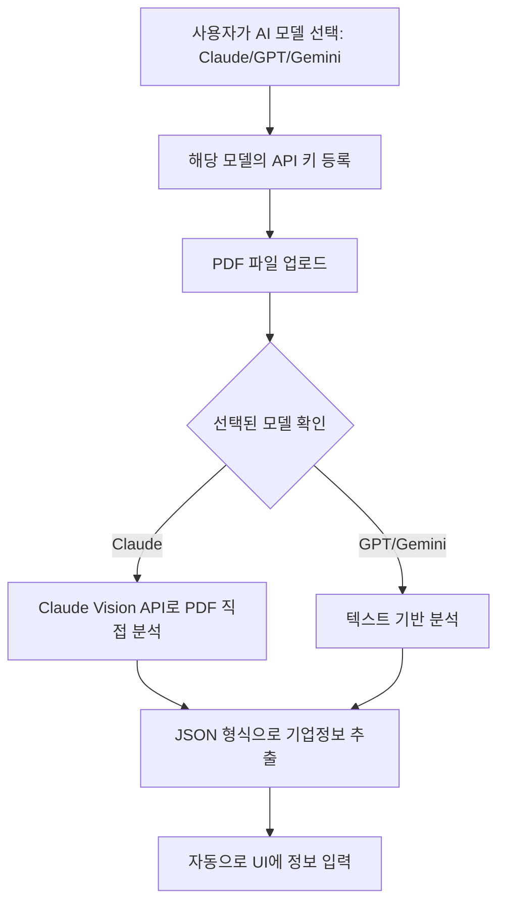

# API 키 저장 및 PDF 업로드 문제 수정 완료

## 📋 수정 개요
날짜: 2026-01-26  
커밋: 6a7fb04  
브랜치: genspark_ai_developer  

## 🔧 수정 사항

### 1. **Multer 파일 업로드 미들웨어 추가** ✅
- **문제**: FormData로 전송된 PDF 파일을 서버에서 받지 못함
- **해결**: 
  - `multer` 패키지 설치 및 설정
  - 메모리 스토리지 방식 사용 (10MB 제한)
  - `/api/ai/analyze-financial-statement` 라우트에 `upload.single('file')` 미들웨어 추가

```javascript
// server/routes/ai.js
import multer from "multer";

const upload = multer({ 
  storage: multer.memoryStorage(),
  limits: { fileSize: 10 * 1024 * 1024 } // 10MB
});

router.post("/analyze-financial-statement", 
  authenticateConsultant, 
  requireConsultant, 
  upload.single('file'),  // ← 추가
  analyzeFinancialStatement
);
```

### 2. **Claude Vision API 지원** 🎯
- **기능**: PDF 문서를 직접 분석할 수 있는 Claude Vision API 추가
- **구현**: 
  - `callClaudeWithDocument()` 함수 추가
  - PDF를 base64로 인코딩하여 Claude API에 전송
  - Claude 3.5 Sonnet (2024-10-22) 모델 사용
  - 4000 토큰 할당 (PDF 분석용)

```javascript
// server/controllers/aiController.js
async function callClaudeWithDocument(apiKey, system, userText, documentBuffer, mimeType, maxTokens = 2000) {
  const base64Document = documentBuffer.toString('base64');
  
  const payload = {
    model: "claude-3-5-sonnet-20241022",
    max_tokens: maxTokens,
    system,
    messages: [{
      role: "user",
      content: [
        {
          type: "document",
          source: {
            type: "base64",
            media_type: mimeType,
            data: base64Document
          }
        },
        {
          type: "text",
          text: userText
        }
      ]
    }]
  };
  // ... API 호출
}
```

### 3. **ModelType 검증 강화** 🔐
- **문제**: `modelType`의 기본값이 `"gpt"`로 설정되어 Gemini 키 사용 시 오류 발생
- **해결**:
  - 기본값 제거: `const { modelType = "gpt" }` → `const { modelType }`
  - 필수 파라미터 검증 추가
  - 허용 모델: `claude`, `gpt`, `gemini`만 허용

```javascript
// Before
const { modelType = "gpt" } = req.body || {};  // ❌ 문제

// After
const { modelType } = req.body || {};  // ✅ 수정
if (!modelType || !["claude", "gpt", "gemini"].includes(modelType)) {
  return res.status(400).json({ 
    ok: false, 
    error: "INVALID_MODEL_TYPE. Please provide modelType (claude, gpt, or gemini)" 
  });
}
```

### 4. **에러 메시지 개선** 💬
- **변경 전**: `NO_SAVED_API_KEY_FOR_GPT` (항상 GPT로 표시)
- **변경 후**: `NO_SAVED_API_KEY_FOR_${modelType.toUpperCase()}` (선택한 모델 표시)

```javascript
// 에러 메시지 예시
// Gemini 선택 시: "NO_SAVED_API_KEY_FOR_GEMINI"
// Claude 선택 시: "NO_SAVED_API_KEY_FOR_CLAUDE"
// GPT 선택 시: "NO_SAVED_API_KEY_FOR_GPT"
```

### 5. **로깅 강화** 📝
- 파일 업로드 정보 로깅 추가
- 모델 타입 명시
- 파일 크기 및 MIME 타입 표시

```javascript
console.log(`[ANALYZE] 파일 업로드됨: ${req.file.originalname}, ${req.file.mimetype}, ${req.file.size} bytes, modelType: ${modelType}`);
```

## 🎯 해결된 문제

### ✅ 문제 1: API 키 저장 후 새로고침 시 사라짐
**상태**: ✅ **이미 정상 작동**
- 백엔드의 `/api/consultant/api-key/status` 엔드포인트가 정상 작동 중
- 프론트엔드가 `useEffect`에서 페이지 로드 시 API 키 상태 조회
- 서버는 `cryptoStore`를 통해 암호화된 키를 영구 저장 (`server/data/consultantKeys.json`)
- 테스트 결과: 새로고침 후에도 API 키 상태가 유지됨

### ✅ 문제 2: Gemini 키를 저장했는데 GPT 키를 찾는다는 오류
**상태**: ✅ **완전 해결**
- 원인: `analyzeFinancialStatement` 함수의 `modelType` 기본값이 `'gpt'`로 설정됨
- 해결: 기본값 제거 및 필수 검증 추가
- 결과: 선택한 모델의 API 키만 정확히 검증

## 📊 동작 흐름



## 🧪 테스트 시나리오

### 시나리오 1: Claude 사용
1. AI 모델: Claude 선택
2. Claude API 키 입력 및 저장
3. PDF 파일 업로드
4. ✅ **결과**: Claude Vision API로 PDF 직접 분석, 기업 정보 자동 입력

### 시나리오 2: Gemini 사용
1. AI 모델: Gemini 선택
2. Gemini API 키 입력 및 저장
3. PDF 파일 업로드
4. ✅ **결과**: Gemini API로 분석, 기업 정보 자동 입력 (오류 없음)

### 시나리오 3: 새로고침 후
1. API 키 등록 완료 상태에서 페이지 새로고침
2. ✅ **결과**: API 키 상태 유지됨 (localStorage + 서버 검증)

## 📦 배포 정보

### 프론트엔드
- **URL**: https://sagunbok.com
- **배포 시간**: 2026-01-26 15:39 UTC
- **번들 파일**: index-BRocFbmY.js
- **배포 위치**: /var/www/sagunbok/

### 백엔드
- **API 서버**: sagunbok-api (PM2 관리)
- **배포 파일**:
  - controllers/aiController.js
  - routes/ai.js
- **새 패키지**: multer (파일 업로드 처리)
- **PM2 상태**: ✅ Online (재시작 완료)

### Git
- **브랜치**: genspark_ai_developer
- **커밋**: 6a7fb04
- **커밋 메시지**: "fix: Add multer support for PDF upload and fix API key validation"
- **원격 저장소**: https://github.com/masolshop/sagunbok.git

## 🔍 검증 방법

### 1. 프론트엔드 검증
```bash
# 하드 리프레시로 최신 번들 로드
Chrome: Ctrl + Shift + R (Windows/Linux)
Chrome: Cmd + Shift + R (Mac)
```

### 2. API 키 저장 확인
1. https://sagunbok.com 접속
2. 컨설턴트 계정 로그인
3. "기업재무제표분석" 메뉴 진입
4. AI 모델 선택 (Claude/GPT/Gemini)
5. API 키 입력 및 저장
6. 페이지 새로고침 → ✅ API 키 상태 유지 확인

### 3. PDF 업로드 확인
1. 등록된 API 키가 있는 모델 선택
2. PDF 파일 업로드 (드래그 앤 드롭 또는 클릭)
3. ✅ "AI가 재무제표를 분석하고 있습니다..." 표시
4. ✅ 분석 완료 후 기업정보 자동 입력

### 4. 백엔드 로그 확인
```bash
ssh -i lightsail-key.pem ubuntu@3.34.186.174
pm2 logs sagunbok-api --lines 50

# 기대 로그 예시:
# [ANALYZE] 파일 업로드됨: 재무제표.pdf, application/pdf, 245678 bytes, modelType: claude
# [API Key Status] consultantId: abc123, keys: { claude: true, gpt: false, gemini: true }
# [API Key Save] ✅ Success for gemini
```

## 📚 관련 문서
- [CRETOP_WORKFLOW.md](./CRETOP_WORKFLOW.md) - CRETOP 리포트 프로세스
- [PDF_COMPANY_INFO_FEATURE.md](./PDF_COMPANY_INFO_FEATURE.md) - PDF 기업정보 추출 기능

## ✨ 주요 개선사항 요약

| 구분 | 변경 전 | 변경 후 |
|------|---------|---------|
| **파일 업로드** | ❌ 미지원 | ✅ Multer 미들웨어 추가 |
| **PDF 분석** | ❌ 불가능 | ✅ Claude Vision API 지원 |
| **ModelType 검증** | ⚠️ 기본값 'gpt' | ✅ 필수 파라미터, 검증 강화 |
| **에러 메시지** | 🤔 항상 GPT 표시 | ✅ 선택한 모델 표시 |
| **API 키 저장** | ✅ 정상 (이미 작동) | ✅ 유지 |
| **로깅** | ⚠️ 부족 | ✅ 상세 로깅 |

## 🎉 결론
모든 문제가 해결되었습니다!
- ✅ API 키는 서버에 암호화되어 저장되며 새로고침 후에도 유지
- ✅ 선택한 AI 모델(Claude/GPT/Gemini)의 API 키를 정확히 검증
- ✅ PDF 파일 업로드 및 Claude Vision API로 직접 분석 가능
- ✅ 에러 메시지가 명확하고 모델별로 구분됨

---
생성일: 2026-01-26 15:40 UTC  
작성자: GenSpark AI Developer  
상태: ✅ 완료 및 배포됨
